# Project_template

Структура этого файла повторяет структуру заданий.
Заполненного по мере работы над решением.

# Задание 1. Анализ и планирование

<aside>

Чтобы составить документ с описанием текущей архитектуры приложения, можно часть информации взять из описания компании и условия задания. Это нормально.

</aside>

### 1. Описание функциональности монолитного приложения

**Управление отоплением:**

- Пользователи могут:
- * удалённо включать/выключать отопление в своих домах
- * просматривать текущую температуру в разных комнатах
- Система поддерживает базовые сценарии включения/выключения отопления по расписанию

**Мониторинг температуры:**

- Пользователи могут просматривать историю изменения температуры
- Система поддерживает опрос датчиков температуры по запросу (pull-модель)

### 2. Анализ архитектуры монолитного приложения
* Технологический стек:
* * Язык программирования: Go
* * База данных: PostgreSQL
* * Архитектура: Монолитная, все компоненты системы (обработка запросов, бизнес-логика, работа с данными) находятся в рамках одного приложения.
* * Взаимодействие: Синхронное, запросы обрабатываются последовательно.
* * Масштабируемость: Ограничена, так как монолит сложно масштабировать по частям.
* * Развертывание: Требует остановки всего приложения.

* Особенности:
* * Отсутствует асинхронное взаимодействие
* * Нет возможности самостоятельного подключения устройств пользователями
* * Масштабирование возможно только вертикальное
* * Все компоненты связаны в едином коде

### 3. Определение доменов и границы контекстов


[DC.mermaid](docs/as-is/DC.mermaid)
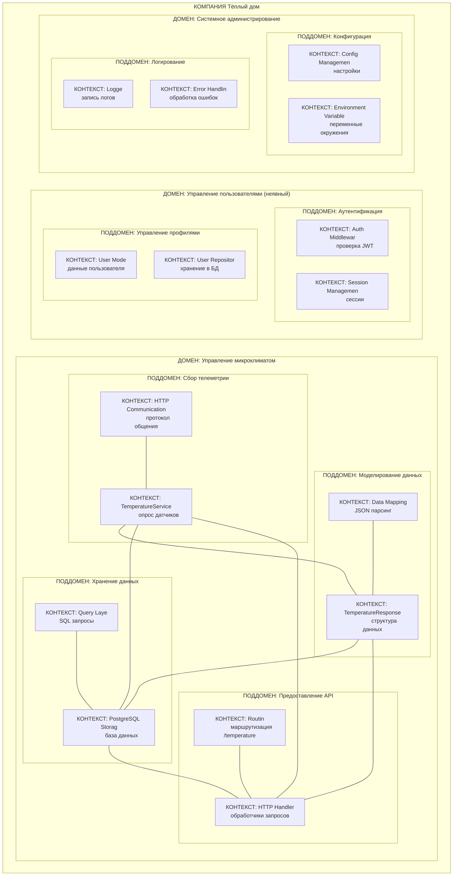

### **4. Проблемы монолитного решения**
* Проблемы монолита:
- - Проблема: Нет чётких границ - все поддомены связаны напрямую
- - Все пакеты импортируют друг друга — циклические зависимости неизбежны
* Проблемы конкретной реализации:
- - Отсутствие самообслуживания - Пользователь не может сам подключить датчик. Масштабирование требует найма специалистов
- - Pull-модель - Сервер опрашивает датчики каждые 15 мин. Избыточный трафик, задержки в данных
- - Одна БД - Все данные в одной PostgreSQL. Нельзя масштабировать по нагрузке
- - Синхронность - Все вызовы блокирующие. При падении датчика виснет весь запрос
- - Связанность - Изменение в отоплении может сломать авторизацию. Страх релизов, долгие тесты
- - Нет событий - Нельзя реагировать на изменения мгновенно. Нет автоматизации
- - Технологическое ограничение - Только Go, только одна БД. Нельзя использовать лучшие инструменты под задачи

### 5. Визуализация контекста системы — диаграмма С4
C1 - [с1.mermaid](docs/as-is/%D1%811.mermaid)
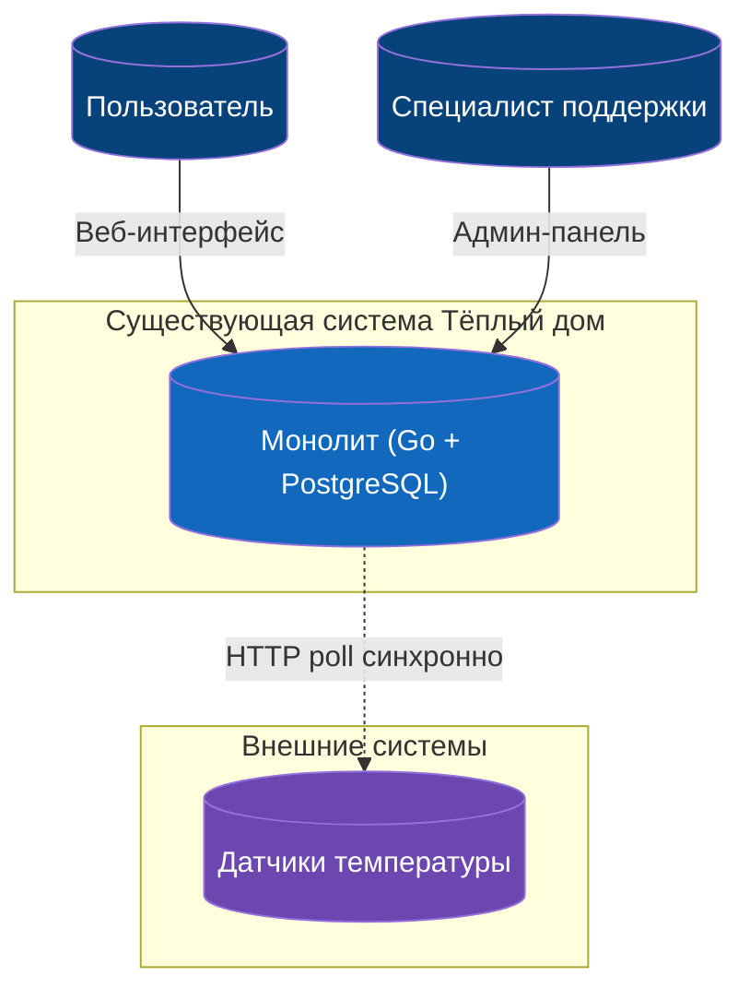

C2 - [c2.mermaid](docs/as-is/c2.mermaid)
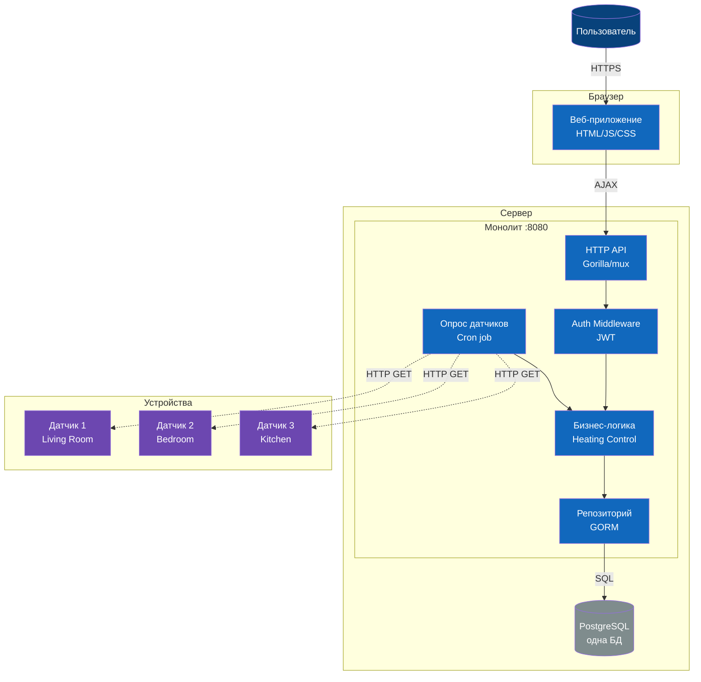

C3 - [с3-bob.mermaid](docs/as-is/%D1%813-bob.mermaid)
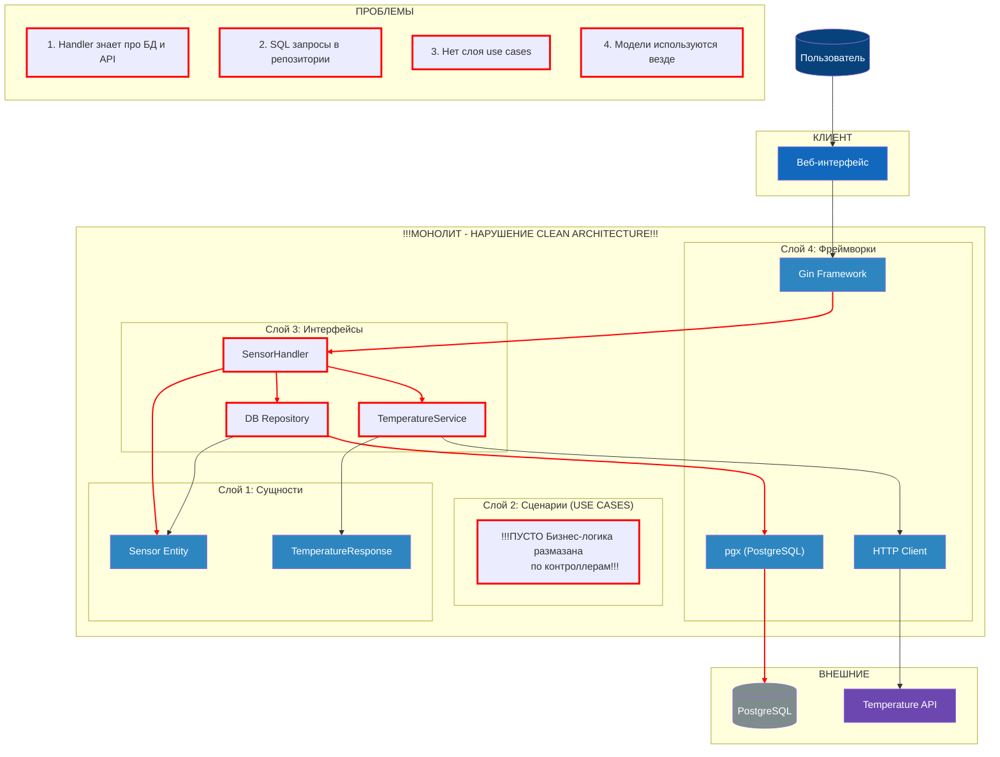

# Задание 2. Проектирование микросервисной архитектуры

Только диаграммы в модели C4.

**Диаграмма контекста (Context)**
* [c1.mermaid](docs/to-be/c1.mermaid)
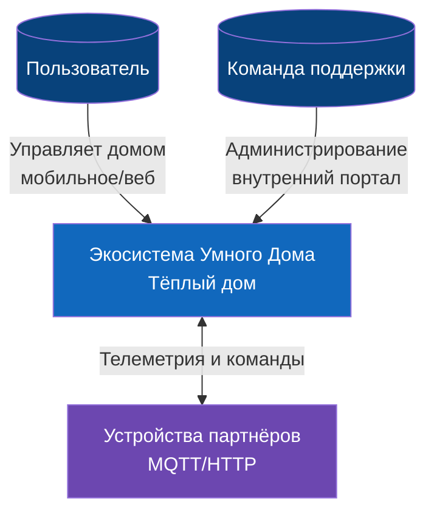

**Диаграмма контейнеров (Containers)**
[c2.mermaid](docs/to-be/c2.mermaid)
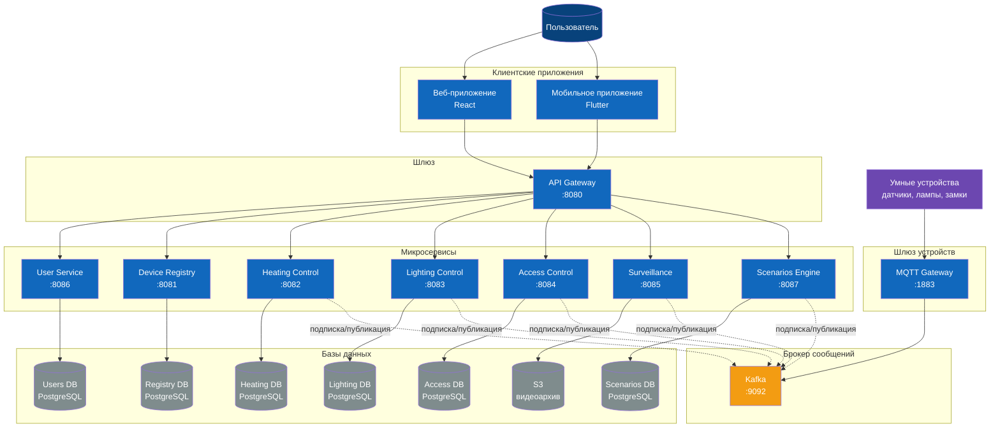

**Диаграмма компонентов (Components)**
* Легенда (общая для всех):
* * 🟣 external - Внешние системы
* * 🟠 framework - Фреймворки и реализации
* * 🟢 repo - Интерфейсы репозиториев
* * 🟪 presenter - Representation слой (адаптеры)
* * 🟡 service - Use Cases и Domain Services
* * ⚪ domain - Domain Entities и Events
* [c3_user_service.mermaid](docs/to-be/c3_user_service.mermaid)
```mermaid
graph TB
    %% Стили
    classDef external fill:#6C47B0,color:#fff,stroke:#333
    classDef framework fill:#E67E22,color:#fff,stroke:#333
    classDef repo fill:#28B463,color:#fff,stroke:#333
    classDef presenter fill:#9B59B6,color:#fff,stroke:#333
    classDef service fill:#F39C12,color:#fff,stroke:#333
    classDef domain fill:#7F8C8D,color:#fff,stroke:#333

    subgraph "Слой 0: Внешние системы"
        PG[(PostgreSQL)]:::external
        Kafka[(Kafka)]:::external
        EmailSvc["Email Service"]:::external
        Redis[(Redis)]:::external
    end

    subgraph "Слой 4: Фреймворки и реализации"
        FastAPI["FastAPI Framework"]:::framework
        AsyncPG["asyncpg"]:::framework
        Aiokafka["aiokafka"]:::framework
        RedisClient["redis-py"]:::framework
        Bcrypt["passlib"]:::framework
        PyJWT["PyJWT"]:::framework

        PostgresUserRepo["PostgresUserRepository
        (реализация UserRepository)"]:::framework
        PostgresInviteRepo["PostgresInviteRepository
        (реализация InviteRepository)"]:::framework
        PostgresRoleRepo["PostgresRoleRepository
        (реализация RoleRepository)"]:::framework
        PostgresMembershipRepo["PostgresMembershipRepository
        (реализация MembershipRepository)"]:::framework

        SMTPEmailSender["SMTPEmailSender
        (реализация EmailGateway)"]:::framework
        KafkaPublisherImpl["KafkaEventPublisher
        (реализация EventPublisher)"]:::framework
        KafkaSubscriberImpl["KafkaEventSubscriber
        (реализация EventSubscriber)"]:::framework
        RedisTokenStore["RedisTokenStore
        (хранение токенов)"]:::framework

        DIContainer["DI Container
        (сборка зависимостей)"]:::framework
    end

    subgraph "Слой 3A: Интерфейсы"
        IUserRepo["<<interface>>
        UserRepository"]:::repo

        IInviteRepo["<<interface>>
        InviteRepository"]:::repo

        IRoleRepo["<<interface>>
        RoleRepository"]:::repo

        IMembershipRepo["<<interface>>
        MembershipRepository"]:::repo

        IEmailGateway["<<interface>>
        EmailGateway"]:::repo

        IEventPublisher["<<interface>>
        EventPublisher"]:::repo

        IEventSubscriber["<<interface>>
        EventSubscriber"]:::repo
    end

    subgraph "Слой 3B: Representation"
        direction TB

        subgraph "Routers"
            AuthRouter["AuthRouter
            (/auth/*)"]:::presenter
            UserRouter["UserRouter
            (/users/*)"]:::presenter
            InviteRouter["InviteRouter
            (/invites/*)"]:::presenter
            RoleRouter["RoleRouter
            (/roles/*)"]:::presenter
        end

        subgraph "Controllers"
            AuthController["AuthController
            регистрация, логин"]:::presenter
            UserController["UserController
            профиль"]:::presenter
            InviteController["InviteController
            приглашения"]:::presenter
            RoleController["RoleController
            роли и права"]:::presenter
        end

        subgraph "Dependencies"
            GetCurrentUserDep["get_current_user()
            (получение пользователя)"]:::presenter
            RequireAdminDep["require_admin()
            (проверка прав)"]:::presenter
        end

        subgraph "Presenters & DTOs"
            JSONPresenter["JSONPresenter"]:::presenter
            UserDTO["UserDTO"]:::presenter
            InviteDTO["InviteDTO"]:::presenter
            RoleDTO["RoleDTO"]:::presenter
        end
    end

    subgraph "Слой 2: Use Cases"
        direction TB

        RegisterUC["RegisterUserUseCase"]:::service
        LoginUC["LoginUseCase"]:::service
        ConfirmEmailUC["ConfirmEmailUseCase"]:::service
        ResetPasswordUC["ResetPasswordUseCase"]:::service

        CreateInviteUC["CreateInviteUseCase"]:::service
        AcceptInviteUC["AcceptInviteUseCase"]:::service
        DeclineInviteUC["DeclineInviteUseCase"]:::service

        CreateRoleUC["CreateRoleUseCase"]:::service
        AssignRoleUC["AssignRoleUseCase"]:::service
        CheckPermissionUC["CheckPermissionUseCase"]:::service

        UpdateProfileUC["UpdateProfileUseCase"]:::service
        DeleteUserUC["DeleteUserUseCase"]:::service
    end

    subgraph "Слой 1: Domain"
        direction TB

        UserEntity["User Entity"]:::domain
        InviteEntity["Invite Entity"]:::domain
        RoleEntity["Role Entity"]:::domain
        MembershipEntity["HomeMembership Entity"]:::domain

        EmailVO["Email Value Object"]:::domain
        PasswordVO["Password Value Object"]:::domain
        PermissionsVO["Permissions Value Object"]:::domain

        UserRegistered["UserRegistered Event"]:::domain
        UserJoinedHome["UserJoinedHome Event"]:::domain
        UserDeleted["UserDeleted Event"]:::domain
        InviteAccepted["InviteAccepted Event"]:::domain

        PasswordService["PasswordService
        (хэширование)"]:::service
        TokenService["TokenService
        (JWT генерация)"]:::service
    end

    %% Связи (аналогично Heating Control)
    DIContainer --> PostgresUserRepo
    DIContainer --> PostgresInviteRepo
    DIContainer --> PostgresRoleRepo
    DIContainer --> PostgresMembershipRepo
    DIContainer --> SMTPEmailSender
    DIContainer --> KafkaPublisherImpl
    DIContainer --> KafkaSubscriberImpl
    DIContainer --> RedisTokenStore
    DIContainer --> PasswordService
    DIContainer --> TokenService
    DIContainer --> RegisterUC
    DIContainer --> LoginUC
    DIContainer --> CreateInviteUC
    DIContainer --> AcceptInviteUC

    FastAPI --> AuthRouter
    FastAPI --> UserRouter
    FastAPI --> InviteRouter
    FastAPI --> RoleRouter

    AuthRouter --> AuthController
    UserRouter --> UserController
    InviteRouter --> InviteController
    RoleRouter --> RoleController

    AuthController --> GetCurrentUserDep
    UserController --> GetCurrentUserDep
    InviteController --> GetCurrentUserDep
    InviteController --> RequireAdminDep
    RoleController --> RequireAdminDep

    AuthController --> RegisterUC
    AuthController --> LoginUC
    AuthController --> ConfirmEmailUC
    UserController --> UpdateProfileUC
    UserController --> DeleteUserUC
    InviteController --> CreateInviteUC
    InviteController --> AcceptInviteUC
    InviteController --> DeclineInviteUC
    RoleController --> CreateRoleUC
    RoleController --> AssignRoleUC
    RoleController --> CheckPermissionUC

    AuthController --> JSONPresenter
    AuthController --> UserDTO
    InviteController --> InviteDTO
    RoleController --> RoleDTO

    RegisterUC --> IUserRepo
    RegisterUC --> IEmailGateway
    RegisterUC --> IEventPublisher
    RegisterUC --> UserEntity
    RegisterUC --> EmailVO
    RegisterUC --> PasswordVO
    RegisterUC --> PasswordService
    RegisterUC --> TokenService
    RegisterUC --> UserRegistered

    LoginUC --> IUserRepo
    LoginUC --> PasswordService
    LoginUC --> TokenService
    LoginUC --> RedisTokenStore

    CreateInviteUC --> IInviteRepo
    CreateInviteUC --> IEmailGateway
    CreateInviteUC --> IEventPublisher
    CreateInviteUC --> InviteEntity
    CreateInviteUC --> EmailVO

    AcceptInviteUC --> IInviteRepo
    AcceptInviteUC --> IMembershipRepo
    AcceptInviteUC --> IEventPublisher
    AcceptInviteUC --> InviteEntity
    AcceptInviteUC --> MembershipEntity
    AcceptInviteUC --> UserJoinedHome
    AcceptInviteUC --> InviteAccepted

    CreateRoleUC --> IRoleRepo
    CreateRoleUC --> RoleEntity
    CreateRoleUC --> PermissionsVO

    AssignRoleUC --> IUserRepo
    AssignRoleUC --> IRoleRepo
    AssignRoleUC --> IMembershipRepo

    IUserRepo -.-> PostgresUserRepo
    IInviteRepo -.-> PostgresInviteRepo
    IRoleRepo -.-> PostgresRoleRepo
    IMembershipRepo -.-> PostgresMembershipRepo
    IEmailGateway -.-> SMTPEmailSender
    IEventPublisher -.-> KafkaPublisherImpl
    IEventSubscriber -.-> KafkaSubscriberImpl

    PostgresUserRepo --> AsyncPG
    PostgresInviteRepo --> AsyncPG
    PostgresRoleRepo --> AsyncPG
    PostgresMembershipRepo --> AsyncPG
    AsyncPG --> PG

    SMTPEmailSender --> EmailSvc
    RedisTokenStore --> RedisClient
    RedisClient --> Redis

    KafkaPublisherImpl --> Aiokafka
    KafkaSubscriberImpl --> Aiokafka
    Aiokafka --> Kafka
```
* [c3_device_registry.mermaid](docs/to-be/c3_device_registry.mermaid)
```mermaid
graph TB
    %% Стили
    classDef external fill:#6C47B0,color:#fff,stroke:#333
    classDef framework fill:#E67E22,color:#fff,stroke:#333
    classDef repo fill:#28B463,color:#fff,stroke:#333
    classDef presenter fill:#9B59B6,color:#fff,stroke:#333
    classDef service fill:#F39C12,color:#fff,stroke:#333
    classDef domain fill:#7F8C8D,color:#fff,stroke:#333

    subgraph "Слой 0: Внешние системы"
        PG[(PostgreSQL)]:::external
        Kafka[(Kafka)]:::external
    end

    subgraph "Слой 4: Фреймворки и реализации"
        FastAPI["FastAPI Framework"]:::framework
        AsyncPG["asyncpg"]:::framework
        Aiokafka["aiokafka"]:::framework

        PostgresHomeRepo["PostgresHomeRepository
        (реализация HomeRepository)"]:::framework
        PostgresDeviceRepo["PostgresDeviceRepository
        (реализация DeviceRepository)"]:::framework
        PostgresModelRepo["PostgresModelRepository
        (реализация ModelRepository)"]:::framework

        KafkaPublisherImpl["KafkaEventPublisher
        (реализация EventPublisher)"]:::framework
        KafkaSubscriberImpl["KafkaEventSubscriber
        (реализация EventSubscriber)"]:::framework

        DIContainer["DI Container"]:::framework
    end

    subgraph "Слой 3A: Интерфейсы"
        IHomeRepo["<<interface>>
        HomeRepository"]:::repo

        IDeviceRepo["<<interface>>
        DeviceRepository"]:::repo

        IModelRepo["<<interface>>
        ModelRepository"]:::repo

        IEventPublisher["<<interface>>
        EventPublisher"]:::repo

        IEventSubscriber["<<interface>>
        EventSubscriber"]:::repo
    end

    subgraph "Слой 3B: Representation"
        direction TB

        HomeRouter["HomeRouter
        (/homes/*)"]:::presenter
        DeviceRouter["DeviceRouter
        (/devices/*)"]:::presenter
        ModelRouter["ModelRouter
        (/models/*)"]:::presenter

        HomeController["HomeController"]:::presenter
        DeviceController["DeviceController"]:::presenter
        ModelController["ModelController"]:::presenter

        GetCurrentUserDep["get_current_user()"]:::presenter
        CheckHomeAccessDep["check_home_access()"]:::presenter

        JSONPresenter["JSONPresenter"]:::presenter
        HomeDTO["HomeDTO"]:::presenter
        DeviceDTO["DeviceDTO"]:::presenter
        ModelDTO["ModelDTO"]:::presenter
    end

    subgraph "Слой 2: Use Cases"
        CreateHomeUC["CreateHomeUseCase"]:::service
        GetHomeUC["GetHomeUseCase"]:::service
        RegisterDeviceUC["RegisterDeviceUseCase"]:::service
        GetDevicesUC["GetDevicesUseCase"]:::service
        UpdateDeviceUC["UpdateDeviceUseCase"]:::service
        DeleteDeviceUC["DeleteDeviceUseCase"]:::service
        AddUserToHomeUC["AddUserToHomeUseCase"]:::service
        RemoveUserFromHomeUC["RemoveUserFromHomeUseCase"]:::service
    end

    subgraph "Слой 1: Domain"
        HomeEntity["Home Entity"]:::domain
        DeviceEntity["Device Entity"]:::domain
        ModelEntity["DeviceModel Entity"]:::domain

        SerialNumberVO["SerialNumber VO"]:::domain
        AuthTokenVO["AuthToken VO"]:::domain

        HomeCreated["HomeCreated Event"]:::domain
        DeviceRegistered["DeviceRegistered Event"]:::domain
        DeviceUpdated["DeviceUpdated Event"]:::domain
        DeviceDeleted["DeviceDeleted Event"]:::domain
        UserAddedToHome["UserAddedToHome Event"]:::domain
    end

    %% Связи
    DIContainer --> PostgresHomeRepo
    DIContainer --> PostgresDeviceRepo
    DIContainer --> PostgresModelRepo
    DIContainer --> KafkaPublisherImpl
    DIContainer --> KafkaSubscriberImpl
    DIContainer --> CreateHomeUC
    DIContainer --> RegisterDeviceUC
    DIContainer --> GetDevicesUC

    FastAPI --> HomeRouter
    FastAPI --> DeviceRouter
    FastAPI --> ModelRouter

    HomeRouter --> HomeController
    DeviceRouter --> DeviceController
    ModelRouter --> ModelController

    HomeController --> GetCurrentUserDep
    HomeController --> CheckHomeAccessDep
    DeviceController --> GetCurrentUserDep
    DeviceController --> CheckHomeAccessDep

    HomeController --> CreateHomeUC
    HomeController --> GetHomeUC
    HomeController --> AddUserToHomeUC
    HomeController --> RemoveUserFromHomeUC
    DeviceController --> RegisterDeviceUC
    DeviceController --> GetDevicesUC
    DeviceController --> UpdateDeviceUC
    DeviceController --> DeleteDeviceUC
    ModelController --> GetDevicesUC

    HomeController --> JSONPresenter
    HomeController --> HomeDTO
    DeviceController --> DeviceDTO
    ModelController --> ModelDTO

    CreateHomeUC --> IHomeRepo
    CreateHomeUC --> IEventPublisher
    CreateHomeUC --> HomeEntity
    CreateHomeUC --> HomeCreated

    RegisterDeviceUC --> IDeviceRepo
    RegisterDeviceUC --> IModelRepo
    RegisterDeviceUC --> IEventPublisher
    RegisterDeviceUC --> DeviceEntity
    RegisterDeviceUC --> ModelEntity
    RegisterDeviceUC --> SerialNumberVO
    RegisterDeviceUC --> AuthTokenVO
    RegisterDeviceUC --> DeviceRegistered

    GetDevicesUC --> IDeviceRepo
    GetDevicesUC --> DeviceEntity

    UpdateDeviceUC --> IDeviceRepo
    UpdateDeviceUC --> IEventPublisher
    UpdateDeviceUC --> DeviceEntity
    UpdateDeviceUC --> DeviceUpdated

    DeleteDeviceUC --> IDeviceRepo
    DeleteDeviceUC --> IEventPublisher
    DeleteDeviceUC --> DeviceDeleted

    AddUserToHomeUC --> IHomeRepo
    AddUserToHomeUC --> IEventPublisher
    AddUserToHomeUC --> HomeEntity
    AddUserToHomeUC --> UserAddedToHome

    IHomeRepo -.-> PostgresHomeRepo
    IDeviceRepo -.-> PostgresDeviceRepo
    IModelRepo -.-> PostgresModelRepo
    IEventPublisher -.-> KafkaPublisherImpl
    IEventSubscriber -.-> KafkaSubscriberImpl

    PostgresHomeRepo --> AsyncPG
    PostgresDeviceRepo --> AsyncPG
    PostgresModelRepo --> AsyncPG
    AsyncPG --> PG

    KafkaPublisherImpl --> Aiokafka
    KafkaSubscriberImpl --> Aiokafka
    Aiokafka --> Kafka
```
* [c3_lighting_control.mermaid](docs/to-be/c3_lighting_control.mermaid)
```mermaid
graph TB
    %% Стили
    classDef external fill:#6C47B0,color:#fff,stroke:#333
    classDef framework fill:#E67E22,color:#fff,stroke:#333
    classDef repo fill:#28B463,color:#fff,stroke:#333
    classDef presenter fill:#9B59B6,color:#fff,stroke:#333
    classDef service fill:#F39C12,color:#fff,stroke:#333
    classDef domain fill:#7F8C8D,color:#fff,stroke:#333

    subgraph "Слой 0: Внешние системы"
        PG[(PostgreSQL)]:::external
        Kafka[(Kafka)]:::external
        ZigbeeGW["Zigbee Gateway"]:::external
    end

    subgraph "Слой 4: Фреймворки и реализации"
        FastAPI["FastAPI Framework"]:::framework
        AsyncPG["asyncpg"]:::framework
        Aiokafka["aiokafka"]:::framework
        ZigbeeLib["zigbee-herdsman"]:::framework

        PostgresLightRepo["PostgresLightRepository
        (реализация LightRepository)"]:::framework
        PostgresGroupRepo["PostgresGroupRepository
        (реализация GroupRepository)"]:::framework
        PostgresSceneRepo["PostgresSceneRepository
        (реализация SceneRepository)"]:::framework

        ZigbeeGatewayImpl["ZigbeeDeviceGateway
        (реализация DeviceGateway)"]:::framework
        KafkaPublisherImpl["KafkaEventPublisher"]:::framework
        KafkaSubscriberImpl["KafkaEventSubscriber"]:::framework

        DIContainer["DI Container"]:::framework
    end

    subgraph "Слой 3A: Интерфейсы"
        ILightRepo["<<interface>>
        LightRepository"]:::repo

        IGroupRepo["<<interface>>
        GroupRepository"]:::repo

        ISceneRepo["<<interface>>
        SceneRepository"]:::repo

        IDeviceGateway["<<interface>>
        DeviceGateway"]:::repo

        IEventPublisher["<<interface>>
        EventPublisher"]:::repo

        IEventSubscriber["<<interface>>
        EventSubscriber"]:::repo
    end

    subgraph "Слой 3B: Representation"
        LightRouter["LightRouter
        (/lights/*)"]:::presenter
        GroupRouter["GroupRouter
        (/groups/*)"]:::presenter
        SceneRouter["SceneRouter
        (/scenes/*)"]:::presenter

        LightController["LightController"]:::presenter
        GroupController["GroupController"]:::presenter
        SceneController["SceneController"]:::presenter

        GetCurrentUserDep["get_current_user()"]:::presenter
        CheckHomeAccessDep["check_home_access()"]:::presenter

        JSONPresenter["JSONPresenter"]:::presenter
        LightDTO["LightDTO"]:::presenter
        GroupDTO["GroupDTO"]:::presenter
        SceneDTO["SceneDTO"]:::presenter
    end

    subgraph "Слой 2: Use Cases"
        GetLightStateUC["GetLightStateUseCase"]:::service
        SetPowerUC["SetPowerUseCase"]:::service
        SetBrightnessUC["SetBrightnessUseCase"]:::service
        SetColorUC["SetColorUseCase"]:::service
        CreateGroupUC["CreateGroupUseCase"]:::service
        GroupPowerUC["GroupPowerUseCase"]:::service
        CreateSceneUC["CreateSceneUseCase"]:::service
        ActivateSceneUC["ActivateSceneUseCase"]:::service
        ProcessMotionEventUC["ProcessMotionEventUseCase"]:::service
    end

    subgraph "Слой 1: Domain"
        LightEntity["Light Entity"]:::domain
        GroupEntity["Group Entity"]:::domain
        SceneEntity["Scene Entity"]:::domain

        BrightnessVO["Brightness VO"]:::domain
        ColorVO["Color VO"]:::domain

        LightChanged["LightChanged Event"]:::domain
        GroupChanged["GroupChanged Event"]:::domain
        SceneActivated["SceneActivated Event"]:::domain
        MotionDetected["MotionDetected Event"]:::domain
    end

    %% Связи
    DIContainer --> PostgresLightRepo
    DIContainer --> PostgresGroupRepo
    DIContainer --> PostgresSceneRepo
    DIContainer --> ZigbeeGatewayImpl
    DIContainer --> KafkaPublisherImpl
    DIContainer --> KafkaSubscriberImpl

    FastAPI --> LightRouter
    FastAPI --> GroupRouter
    FastAPI --> SceneRouter

    LightRouter --> LightController
    GroupRouter --> GroupController
    SceneRouter --> SceneController

    LightController --> GetCurrentUserDep
    LightController --> CheckHomeAccessDep
    GroupController --> CheckHomeAccessDep
    SceneController --> CheckHomeAccessDep

    LightController --> GetLightStateUC
    LightController --> SetPowerUC
    LightController --> SetBrightnessUC
    LightController --> SetColorUC
    GroupController --> CreateGroupUC
    GroupController --> GroupPowerUC
    SceneController --> CreateSceneUC
    SceneController --> ActivateSceneUC

    LightController --> JSONPresenter
    LightController --> LightDTO
    GroupController --> GroupDTO
    SceneController --> SceneDTO

    GetLightStateUC --> ILightRepo
    GetLightStateUC --> LightEntity

    SetPowerUC --> ILightRepo
    SetPowerUC --> IDeviceGateway
    SetPowerUC --> IEventPublisher
    SetPowerUC --> LightEntity
    SetPowerUC --> LightChanged

    SetBrightnessUC --> ILightRepo
    SetBrightnessUC --> IDeviceGateway
    SetBrightnessUC --> IEventPublisher
    SetBrightnessUC --> LightEntity
    SetBrightnessUC --> LightChanged

    CreateGroupUC --> IGroupRepo
    CreateGroupUC --> GroupEntity

    GroupPowerUC --> IGroupRepo
    GroupPowerUC --> IDeviceGateway
    GroupPowerUC --> IEventPublisher
    GroupPowerUC --> GroupChanged

    CreateSceneUC --> ISceneRepo
    CreateSceneUC --> SceneEntity

    ActivateSceneUC --> ISceneRepo
    ActivateSceneUC --> IDeviceGateway
    ActivateSceneUC --> IEventPublisher
    ActivateSceneUC --> SceneEntity
    ActivateSceneUC --> SceneActivated

    ProcessMotionEventUC --> ILightRepo
    ProcessMotionEventUC --> IDeviceGateway
    ProcessMotionEventUC --> IEventPublisher

    ILightRepo -.-> PostgresLightRepo
    IGroupRepo -.-> PostgresGroupRepo
    ISceneRepo -.-> PostgresSceneRepo
    IDeviceGateway -.-> ZigbeeGatewayImpl
    IEventPublisher -.-> KafkaPublisherImpl
    IEventSubscriber -.-> KafkaSubscriberImpl

    PostgresLightRepo --> AsyncPG
    PostgresGroupRepo --> AsyncPG
    PostgresSceneRepo --> AsyncPG
    AsyncPG --> PG

    ZigbeeGatewayImpl --> ZigbeeLib
    ZigbeeLib --> ZigbeeGW

    KafkaPublisherImpl --> Aiokafka
    KafkaSubscriberImpl --> Aiokafka
    Aiokafka --> Kafka

    KafkaSubscriberImpl --> ProcessMotionEventUC
```
* [c3_access_control.mermaid](docs/to-be/c3_access_control.mermaid)
```mermaid
graph TB
    %% Стили
    classDef external fill:#6C47B0,color:#fff,stroke:#333
    classDef framework fill:#E67E22,color:#fff,stroke:#333
    classDef repo fill:#28B463,color:#fff,stroke:#333
    classDef presenter fill:#9B59B6,color:#fff,stroke:#333
    classDef service fill:#F39C12,color:#fff,stroke:#333
    classDef domain fill:#7F8C8D,color:#fff,stroke:#333

    subgraph "Слой 0: Внешние системы"
        PG[(PostgreSQL)]:::external
        Kafka[(Kafka)]:::external
        MQTT["MQTT Broker"]:::external
        SMS["SMS Gateway"]:::external
    end

    subgraph "Слой 4: Фреймворки и реализации"
        FastAPI["FastAPI Framework"]:::framework
        AsyncPG["asyncpg"]:::framework
        Aiokafka["aiokafka"]:::framework
        AioMQTT["asyncio-mqtt"]:::framework
        HTTPX["httpx"]:::framework

        PostgresLockRepo["PostgresLockRepository
        (реализация LockRepository)"]:::framework
        PostgresPermissionRepo["PostgresPermissionRepository
        (реализация PermissionRepository)"]:::framework
        PostgresAuditRepo["PostgresAuditRepository
        (реализация AuditRepository)"]:::framework

        MQTTGatewayImpl["MQTTDeviceGateway
        (реализация DeviceGateway)"]:::framework
        SMSGatewayImpl["SMSGateway
        (реализация SMSGateway)"]:::framework
        KafkaPublisherImpl["KafkaEventPublisher"]:::framework
        KafkaSubscriberImpl["KafkaEventSubscriber"]:::framework

        DIContainer["DI Container"]:::framework
    end

    subgraph "Слой 3A: Интерфейсы"
        ILockRepo["<<interface>>
        LockRepository"]:::repo

        IPermissionRepo["<<interface>>
        PermissionRepository"]:::repo

        IAuditRepo["<<interface>>
        AuditRepository"]:::repo

        IDeviceGateway["<<interface>>
        DeviceGateway"]:::repo

        ISMSGateway["<<interface>>
        SMSGateway"]:::repo

        IEventPublisher["<<interface>>
        EventPublisher"]:::repo

        IEventSubscriber["<<interface>>
        EventSubscriber"]:::repo
    end

    subgraph "Слой 3B: Representation"
        LockRouter["LockRouter
        (/locks/*)"]:::presenter
        GateRouter["GateRouter
        (/gates/*)"]:::presenter
        PermissionRouter["PermissionRouter
        (/permissions/*)"]:::presenter
        TemporaryRouter["TemporaryRouter
        (/temporary/*)"]:::presenter
        AuditRouter["AuditRouter
        (/audit/*)"]:::presenter

        LockController["LockController"]:::presenter
        GateController["GateController"]:::presenter
        PermissionController["PermissionController"]:::presenter
        TemporaryController["TemporaryController"]:::presenter
        AuditController["AuditController"]:::presenter

        GetCurrentUserDep["get_current_user()"]:::presenter
        RequireAdminDep["require_admin()"]:::presenter

        JSONPresenter["JSONPresenter"]:::presenter
        LockDTO["LockDTO"]:::presenter
        PermissionDTO["PermissionDTO"]:::presenter
        AuditDTO["AuditDTO"]:::presenter
    end

    subgraph "Слой 2: Use Cases"
        LockUC["LockUseCase"]:::service
        UnlockUC["UnlockUseCase"]:::service
        OpenGateUC["OpenGateUseCase"]:::service
        CloseGateUC["CloseGateUseCase"]:::service

        CreatePermissionUC["CreatePermissionUseCase"]:::service
        RevokePermissionUC["RevokePermissionUseCase"]:::service

        CreateTemporaryUC["CreateTemporaryAccessUseCase"]:::service
        VerifyCodeUC["VerifyCodeUseCase"]:::service

        GetAuditUC["GetAuditUseCase"]:::service

        HandleUserDeletedUC["HandleUserDeletedUseCase"]:::service
    end

    subgraph "Слой 1: Domain"
        LockEntity["Lock Entity"]:::domain
        PermissionEntity["Permission Entity"]:::domain
        AuditEntity["AuditEntry Entity"]:::domain
        TemporaryCodeEntity["TemporaryCode Entity"]:::domain

        DeviceLocked["DeviceLocked Event"]:::domain
        DeviceUnlocked["DeviceUnlocked Event"]:::domain
        GateOpened["GateOpened Event"]:::domain
        PermissionGranted["PermissionGranted Event"]:::domain
        CodeGenerated["TemporaryCodeGenerated Event"]:::domain

        AccessService["AccessService
        (проверка прав)"]:::service
    end

    %% Связи
    DIContainer --> PostgresLockRepo
    DIContainer --> PostgresPermissionRepo
    DIContainer --> PostgresAuditRepo
    DIContainer --> MQTTGatewayImpl
    DIContainer --> SMSGatewayImpl
    DIContainer --> KafkaPublisherImpl
    DIContainer --> KafkaSubscriberImpl
    DIContainer --> AccessService

    FastAPI --> LockRouter
    FastAPI --> GateRouter
    FastAPI --> PermissionRouter
    FastAPI --> TemporaryRouter
    FastAPI --> AuditRouter

    LockRouter --> LockController
    GateRouter --> GateController
    PermissionRouter --> PermissionController
    TemporaryRouter --> TemporaryController
    AuditRouter --> AuditController

    LockController --> GetCurrentUserDep
    LockController --> RequireAdminDep
    PermissionController --> RequireAdminDep
    TemporaryController --> GetCurrentUserDep

    LockController --> LockUC
    LockController --> UnlockUC
    GateController --> OpenGateUC
    GateController --> CloseGateUC
    PermissionController --> CreatePermissionUC
    PermissionController --> RevokePermissionUC
    TemporaryController --> CreateTemporaryUC
    TemporaryController --> VerifyCodeUC
    AuditController --> GetAuditUC

    LockController --> JSONPresenter
    LockController --> LockDTO
    PermissionController --> PermissionDTO
    AuditController --> AuditDTO

    LockUC --> IPermissionRepo
    LockUC --> IDeviceGateway
    LockUC --> IAuditRepo
    LockUC --> IEventPublisher
    LockUC --> LockEntity
    LockUC --> PermissionEntity
    LockUC --> AuditEntity
    LockUC --> DeviceLocked

    CreatePermissionUC --> IPermissionRepo
    CreatePermissionUC --> IEventPublisher
    CreatePermissionUC --> PermissionEntity
    CreatePermissionUC --> PermissionGranted

    CreateTemporaryUC --> IPermissionRepo
    CreateTemporaryUC --> ISMSGateway
    CreateTemporaryUC --> IEventPublisher
    CreateTemporaryUC --> TemporaryCodeEntity
    CreateTemporaryUC --> CodeGenerated

    VerifyCodeUC --> IPermissionRepo
    VerifyCodeUC --> IAuditRepo
    VerifyCodeUC --> TemporaryCodeEntity

    GetAuditUC --> IAuditRepo
    GetAuditUC --> AuditEntity

    HandleUserDeletedUC --> IPermissionRepo
    HandleUserDeletedUC --> IAuditRepo

    ILockRepo -.-> PostgresLockRepo
    IPermissionRepo -.-> PostgresPermissionRepo
    IAuditRepo -.-> PostgresAuditRepo
    IDeviceGateway -.-> MQTTGatewayImpl
    ISMSGateway -.-> SMSGatewayImpl
    IEventPublisher -.-> KafkaPublisherImpl
    IEventSubscriber -.-> KafkaSubscriberImpl

    PostgresLockRepo --> AsyncPG
    PostgresPermissionRepo --> AsyncPG
    PostgresAuditRepo --> AsyncPG
    AsyncPG --> PG

    MQTTGatewayImpl --> AioMQTT
    AioMQTT --> MQTT

    SMSGatewayImpl --> HTTPX
    HTTPX --> SMS

    KafkaPublisherImpl --> Aiokafka
    KafkaSubscriberImpl --> Aiokafka
    Aiokafka --> Kafka

    KafkaSubscriberImpl --> HandleUserDeletedUC
```
* [c3_surveillance.mermaid](docs/to-be/c3_surveillance.mermaid)
```mermaid
graph TB
    %% Стили
    classDef external fill:#6C47B0,color:#fff,stroke:#333
    classDef framework fill:#E67E22,color:#fff,stroke:#333
    classDef repo fill:#28B463,color:#fff,stroke:#333
    classDef presenter fill:#9B59B6,color:#fff,stroke:#333
    classDef service fill:#F39C12,color:#fff,stroke:#333
    classDef domain fill:#7F8C8D,color:#fff,stroke:#333

    subgraph "Слой 0: Внешние системы"
        PG[(PostgreSQL)]:::external
        Kafka[(Kafka)]:::external
        MinIO[(MinIO Storage)]:::external
        Cameras["RTSP Cameras"]:::external
    end

    subgraph "Слой 4: Фреймворки и реализации"
        FastAPI["FastAPI Framework"]:::framework
        AsyncPG["asyncpg"]:::framework
        Aiokafka["aiokafka"]:::framework
        OpenCV["opencv-python"]:::framework
        AIOBoto3["aioboto3 (S3 client)"]:::framework

        PostgresCameraRepo["PostgresCameraRepository
        (реализация CameraRepository)"]:::framework
        PostgresRecordingRepo["PostgresRecordingRepository
        (реализация RecordingRepository)"]:::framework

        CameraGatewayImpl["RTSPCameraGateway
        (реализация CameraGateway)"]:::framework
        StorageGatewayImpl["S3StorageGateway
        (реализация StorageGateway)"]:::framework
        KafkaPublisherImpl["KafkaEventPublisher"]:::framework
        KafkaSubscriberImpl["KafkaEventSubscriber"]:::framework

        DIContainer["DI Container"]:::framework
    end

    subgraph "Слой 3A: Интерфейсы"
        ICameraRepo["<<interface>>
        CameraRepository"]:::repo

        IRecordingRepo["<<interface>>
        RecordingRepository"]:::repo

        ICameraGateway["<<interface>>
        CameraGateway"]:::repo

        IStorageGateway["<<interface>>
        StorageGateway"]:::repo

        IEventPublisher["<<interface>>
        EventPublisher"]:::repo

        IEventSubscriber["<<interface>>
        EventSubscriber"]:::repo
    end

    subgraph "Слой 3B: Representation"
        CameraRouter["CameraRouter
        (/cameras/*)"]:::presenter
        StreamRouter["StreamRouter
        (/streams/*)"]:::presenter
        RecordingRouter["RecordingRouter
        (/recordings/*)"]:::presenter
        EventRouter["EventRouter
        (/events/*)"]:::presenter

        CameraController["CameraController"]:::presenter
        StreamController["StreamController"]:::presenter
        RecordingController["RecordingController"]:::presenter
        EventController["EventController"]:::presenter

        GetCurrentUserDep["get_current_user()"]:::presenter
        CheckHomeAccessDep["check_home_access()"]:::presenter

        JSONPresenter["JSONPresenter"]:::presenter
        CameraDTO["CameraDTO"]:::presenter
        RecordingDTO["RecordingDTO"]:::presenter
        EventDTO["EventDTO"]:::presenter
    end

    subgraph "Слой 2: Use Cases"
        GetCamerasUC["GetCamerasUseCase"]:::service
        GetStreamUC["GetStreamUseCase"]:::service
        GetSnapshotUC["GetSnapshotUseCase"]:::service
        StartRecordingUC["StartRecordingUseCase"]:::service
        StopRecordingUC["StopRecordingUseCase"]:::service
        GetRecordingsUC["GetRecordingsUseCase"]:::service
        ProcessMotionUC["ProcessMotionUseCase"]:::service
        HandleDoorEventUC["HandleDoorEventUseCase"]:::service
    end

    subgraph "Слой 1: Domain"
        CameraEntity["Camera Entity"]:::domain
        RecordingEntity["Recording Entity"]:::domain
        EventEntity["Event Entity"]:::domain

        RecordingStarted["RecordingStarted Event"]:::domain
        RecordingStopped["RecordingStopped Event"]:::domain
        MotionDetected["MotionDetected Event"]:::domain
    end

    %% Связи
    DIContainer --> PostgresCameraRepo
    DIContainer --> PostgresRecordingRepo
    DIContainer --> CameraGatewayImpl
    DIContainer --> StorageGatewayImpl
    DIContainer --> KafkaPublisherImpl
    DIContainer --> KafkaSubscriberImpl

    FastAPI --> CameraRouter
    FastAPI --> StreamRouter
    FastAPI --> RecordingRouter
    FastAPI --> EventRouter

    CameraRouter --> CameraController
    StreamRouter --> StreamController
    RecordingRouter --> RecordingController
    EventRouter --> EventController

    CameraController --> GetCurrentUserDep
    CameraController --> CheckHomeAccessDep
    StreamController --> CheckHomeAccessDep
    RecordingController --> CheckHomeAccessDep

    CameraController --> GetCamerasUC
    StreamController --> GetStreamUC
    StreamController --> GetSnapshotUC
    RecordingController --> StartRecordingUC
    RecordingController --> StopRecordingUC
    RecordingController --> GetRecordingsUC
    EventController --> ProcessMotionUC

    CameraController --> JSONPresenter
    CameraController --> CameraDTO
    RecordingController --> RecordingDTO
    EventController --> EventDTO

    GetCamerasUC --> ICameraRepo
    GetCamerasUC --> CameraEntity

    GetStreamUC --> ICameraRepo
    GetStreamUC --> ICameraGateway

    GetSnapshotUC --> ICameraGateway

    StartRecordingUC --> ICameraRepo
    StartRecordingUC --> ICameraGateway
    StartRecordingUC --> IEventPublisher
    StartRecordingUC --> RecordingEntity
    StartRecordingUC --> RecordingStarted

    StopRecordingUC --> IRecordingRepo
    StopRecordingUC --> IStorageGateway
    StopRecordingUC --> IEventPublisher
    StopRecordingUC --> RecordingEntity
    StopRecordingUC --> RecordingStopped

    GetRecordingsUC --> IRecordingRepo
    GetRecordingsUC --> RecordingEntity

    ProcessMotionUC --> IRecordingRepo
    ProcessMotionUC --> IEventPublisher
    ProcessMotionUC --> EventEntity
    ProcessMotionUC --> MotionDetected

    ICameraRepo -.-> PostgresCameraRepo
    IRecordingRepo -.-> PostgresRecordingRepo
    ICameraGateway -.-> CameraGatewayImpl
    IStorageGateway -.-> StorageGatewayImpl
    IEventPublisher -.-> KafkaPublisherImpl
    IEventSubscriber -.-> KafkaSubscriberImpl

    PostgresCameraRepo --> AsyncPG
    PostgresRecordingRepo --> AsyncPG
    AsyncPG --> PG

    CameraGatewayImpl --> OpenCV
    OpenCV --> Cameras

    StorageGatewayImpl --> AIOBoto3
    AIOBoto3 --> MinIO

    KafkaPublisherImpl --> Aiokafka
    KafkaSubscriberImpl --> Aiokafka
    Aiokafka --> Kafka

    KafkaSubscriberImpl --> HandleDoorEventUC
```
* [c3_scenarios_engine.mermaid](docs/to-be/c3_scenarios_engine.mermaid)
```mermaid
graph TB
    %% Стили
    classDef external fill:#6C47B0,color:#fff,stroke:#333
    classDef framework fill:#E67E22,color:#fff,stroke:#333
    classDef repo fill:#28B463,color:#fff,stroke:#333
    classDef presenter fill:#9B59B6,color:#fff,stroke:#333
    classDef service fill:#F39C12,color:#fff,stroke:#333
    classDef domain fill:#7F8C8D,color:#fff,stroke:#333

    subgraph "Слой 0: Внешние системы"
        PG[(PostgreSQL)]:::external
        Kafka[(Kafka)]:::external
        Redis[(Redis)]:::external
    end

    subgraph "Слой 4: Фреймворки и реализации"
        FastAPI["FastAPI Framework"]:::framework
        AsyncPG["asyncpg"]:::framework
        Aiokafka["aiokafka"]:::framework
        RedisClient["redis-py"]:::framework
        APScheduler["apscheduler"]:::framework

        PostgresScenarioRepo["PostgresScenarioRepository
        (реализация ScenarioRepository)"]:::framework
        PostgresExecutionRepo["PostgresExecutionRepository
        (реализация ExecutionRepository)"]:::framework

        KafkaPublisherImpl["KafkaEventPublisher"]:::framework
        KafkaSubscriberImpl["KafkaEventSubscriber"]:::framework
        SchedulerImpl["APSchedulerAdapter"]:::framework

        DIContainer["DI Container"]:::framework
    end

    subgraph "Слой 3A: Интерфейсы"
        IScenarioRepo["<<interface>>
        ScenarioRepository"]:::repo

        IExecutionRepo["<<interface>>
        ExecutionRepository"]:::repo

        IEventPublisher["<<interface>>
        EventPublisher"]:::repo

        IEventSubscriber["<<interface>>
        EventSubscriber"]:::repo

        IScheduler["<<interface>>
        Scheduler"]:::repo
    end

    subgraph "Слой 3B: Representation"
        ScenarioRouter["ScenarioRouter
        (/scenarios/*)"]:::presenter
        ControlRouter["ControlRouter
        (/control/*)"]:::presenter
        ExecutionRouter["ExecutionRouter
        (/executions/*)"]:::presenter

        ScenarioController["ScenarioController"]:::presenter
        ControlController["ControlController"]:::presenter
        ExecutionController["ExecutionController"]:::presenter

        GetCurrentUserDep["get_current_user()"]:::presenter
        CheckHomeAccessDep["check_home_access()"]:::presenter

        JSONPresenter["JSONPresenter"]:::presenter
        ScenarioDTO["ScenarioDTO"]:::presenter
        ExecutionDTO["ExecutionDTO"]:::presenter
    end

    subgraph "Слой 2: Use Cases"
        CreateScenarioUC["CreateScenarioUseCase"]:::service
        GetScenarioUC["GetScenarioUseCase"]:::service
        UpdateScenarioUC["UpdateScenarioUseCase"]:::service
        DeleteScenarioUC["DeleteScenarioUseCase"]:::service
        EnableScenarioUC["EnableScenarioUseCase"]:::service
        DisableScenarioUC["DisableScenarioUseCase"]:::service
        EvaluateTriggersUC["EvaluateTriggersUseCase"]:::service
        ExecuteScenarioUC["ExecuteScenarioUseCase"]:::service
        GetExecutionsUC["GetExecutionsUseCase"]:::service
    end

    subgraph "Слой 1: Domain"
        ScenarioEntity["Scenario Entity"]:::domain
        ExecutionEntity["Execution Entity"]:::domain

        TriggerVO["Trigger Value Object"]:::domain
        ConditionVO["Condition Value Object"]:::domain
        ActionVO["Action Value Object"]:::domain

        ScenarioTriggered["ScenarioTriggered Event"]:::domain
        ScenarioExecuted["ScenarioExecuted Event"]:::domain
    end

    %% Связи
    DIContainer --> PostgresScenarioRepo
    DIContainer --> PostgresExecutionRepo
    DIContainer --> KafkaPublisherImpl
    DIContainer --> KafkaSubscriberImpl
    DIContainer --> SchedulerImpl

    FastAPI --> ScenarioRouter
    FastAPI --> ControlRouter
    FastAPI --> ExecutionRouter

    ScenarioRouter --> ScenarioController
    ControlRouter --> ControlController
    ExecutionRouter --> ExecutionController

    ScenarioController --> GetCurrentUserDep
    ScenarioController --> CheckHomeAccessDep
    ControlController --> CheckHomeAccessDep

    ScenarioController --> CreateScenarioUC
    ScenarioController --> GetScenarioUC
    ScenarioController --> UpdateScenarioUC
    ScenarioController --> DeleteScenarioUC
    ControlController --> EnableScenarioUC
    ControlController --> DisableScenarioUC
    ControlController --> ExecuteScenarioUC
    ExecutionController --> GetExecutionsUC

    ScenarioController --> JSONPresenter
    ScenarioController --> ScenarioDTO
    ExecutionController --> ExecutionDTO

    CreateScenarioUC --> IScenarioRepo
    CreateScenarioUC --> IEventPublisher
    CreateScenarioUC --> IScheduler
    CreateScenarioUC --> ScenarioEntity
    CreateScenarioUC --> TriggerVO
    CreateScenarioUC --> ConditionVO
    CreateScenarioUC --> ActionVO
    CreateScenarioUC --> ScenarioTriggered

    GetScenarioUC --> IScenarioRepo
    GetScenarioUC --> ScenarioEntity

    UpdateScenarioUC --> IScenarioRepo
    UpdateScenarioUC --> ScenarioEntity
    UpdateScenarioUC --> IScheduler

    DeleteScenarioUC --> IScenarioRepo
    DeleteScenarioUC --> IScheduler

    EnableScenarioUC --> IScenarioRepo
    EnableScenarioUC --> IScheduler
    EnableScenarioUC --> ScenarioEntity

    DisableScenarioUC --> IScenarioRepo
    DisableScenarioUC --> IScheduler
    DisableScenarioUC --> ScenarioEntity

    EvaluateTriggersUC --> IScenarioRepo
    EvaluateTriggersUC --> ScenarioEntity
    EvaluateTriggersUC --> TriggerVO

    ExecuteScenarioUC --> IScenarioRepo
    ExecuteScenarioUC --> IEventPublisher
    ExecuteScenarioUC --> IExecutionRepo
    ExecuteScenarioUC --> ScenarioEntity
    ExecuteScenarioUC --> ExecutionEntity
    ExecuteScenarioUC --> ConditionVO
    ExecuteScenarioUC --> ActionVO
    ExecuteScenarioUC --> ScenarioExecuted

    GetExecutionsUC --> IExecutionRepo
    GetExecutionsUC --> ExecutionEntity

    IScenarioRepo -.-> PostgresScenarioRepo
    IExecutionRepo -.-> PostgresExecutionRepo
    IEventPublisher -.-> KafkaPublisherImpl
    IEventSubscriber -.-> KafkaSubscriberImpl
    IScheduler -.-> SchedulerImpl

    PostgresScenarioRepo --> AsyncPG
    PostgresExecutionRepo --> AsyncPG
    AsyncPG --> PG

    SchedulerImpl --> APScheduler
    APScheduler --> RedisClient
    RedisClient --> Redis

    KafkaPublisherImpl --> Aiokafka
    KafkaSubscriberImpl --> Aiokafka
    Aiokafka --> Kafka

    KafkaSubscriberImpl --> EvaluateTriggersUC
```
* [с3_heating_control.mermaid](docs/to-be/%D1%813_heating_control.mermaid)
```mermaid
graph TB
    %% Стили
    classDef external fill:#6C47B0,color:#fff,stroke:#333
    classDef framework fill:#E67E22,color:#fff,stroke:#333
    classDef repo fill:#28B463,color:#fff,stroke:#333
    classDef presenter fill:#9B59B6,color:#fff,stroke:#333
    classDef service fill:#F39C12,color:#fff,stroke:#333
    classDef domain fill:#7F8C8D,color:#fff,stroke:#333

    subgraph "Слой 0: Внешние системы"
        PG[(PostgreSQL)]:::external
        Kafka[(Kafka)]:::external
        MQTT["MQTT Broker"]:::external
    end

    subgraph "Слой 4: Фреймворки и реализации"
        FastAPI["FastAPI Framework"]:::framework
        AsyncPG["asyncpg (PostgreSQL driver)"]:::framework
        Aiokafka["aiokafka (Kafka client)"]:::framework
        AioMQTT["asyncio-mqtt (MQTT client)"]:::framework
        
        PostgresStateRepo["PostgresStateRepository
        (реализация StateRepository)"]:::framework
        PostgresScheduleRepo["PostgresScheduleRepository
        (реализация ScheduleRepository)"]:::framework
        MQTTGatewayImpl["MQTTDeviceGateway
        (реализация DeviceGateway)"]:::framework
        KafkaPublisherImpl["KafkaEventPublisher
        (реализация EventPublisher)"]:::framework
        KafkaSubscriberImpl["KafkaEventSubscriber
        (реализация EventSubscriber)"]:::framework
        
        DIContainer["DI Container
        (сборка зависимостей)"]:::framework
    end

    subgraph "Слой 3A: Интерфейсы (Contracts)"
        direction TB
        
        IStateRepo["<<interface>>
        StateRepository"]:::repo
        
        IScheduleRepo["<<interface>>
        ScheduleRepository"]:::repo
        
        IDeviceGateway["<<interface>>
        DeviceGateway"]:::repo
        
        IEventPublisher["<<interface>>
        EventPublisher"]:::repo
        
        IEventSubscriber["<<interface>>
        EventSubscriber"]:::repo
    end

    subgraph "Слой 3B: Representation (Адаптеры)"
        direction TB
        
        subgraph "Routers"
            ThermostatRouter["ThermostatRouter
            (маршруты /thermostat/*)"]:::presenter
            ScheduleRouter["ScheduleRouter
            (маршруты /schedules/*)"]:::presenter
            HistoryRouter["HistoryRouter
            (маршруты /history/*)"]:::presenter
        end
        
        subgraph "Controllers"
            ThermostatController["ThermostatController
            (обработка запросов)"]:::presenter
            ScheduleController["ScheduleController
            (обработка запросов)"]:::presenter
            HistoryController["HistoryController
            (обработка запросов)"]:::presenter
        end
        
        subgraph "Dependencies"
            GetCurrentUserDep["get_current_user()
            (получение пользователя)"]:::presenter
            CheckDeviceAccessDep["check_device_access()
            (проверка доступа)"]:::presenter
        end
        
        subgraph "Presenters & DTOs"
            JSONPresenter["JSONPresenter
            (форматирование ответов)"]:::presenter
            TemperatureDTO["TemperatureDTO
            (Pydantic модель)"]:::presenter
            ScheduleDTO["ScheduleDTO
            (Pydantic модель)"]:::presenter
        end
    end

    subgraph "Слой 2: Use Cases"
        direction TB
        
        GetStateUC["GetStateUseCase
        (получение состояния)"]:::service
        
        SetTargetTempUC["SetTargetTemperatureUseCase
        (установка температуры)"]:::service
        
        SetModeUC["SetModeUseCase
        (смена режима)"]:::service
        
        CreateScheduleUC["CreateScheduleUseCase
        (создание расписания)"]:::service
        
        GetHistoryUC["GetHistoryUseCase
        (история показаний)"]:::service
        
        ProcessTelemetryUC["ProcessTelemetryUseCase
        (обработка телеметрии)"]:::service
        
        HandleScheduleTriggerUC["HandleScheduleTriggerUseCase
        (обработка расписания)"]:::service
    end

    subgraph "Слой 1: Domain"
        direction TB
        
        AccessService["AccessService
        (проверка прав доступа)"]:::service
        
        ThermostatEntity["Thermostat Entity"]:::domain
        ScheduleEntity["Schedule Entity"]:::domain
        TemperatureReadingVO["TemperatureReading VO"]:::domain
        
        TemperatureChanged["TemperatureChanged Event"]:::domain
        ModeChanged["ModeChanged Event"]:::domain
        ScheduleTriggered["ScheduleTriggered Event"]:::domain
    end

    %% ========== СВЯЗИ ==========
    
    %% DI Container связи
    DIContainer --> PostgresStateRepo
    DIContainer --> PostgresScheduleRepo
    DIContainer --> MQTTGatewayImpl
    DIContainer --> KafkaPublisherImpl
    DIContainer --> KafkaSubscriberImpl
    DIContainer --> AccessService
    DIContainer --> GetStateUC
    DIContainer --> SetTargetTempUC
    DIContainer --> SetModeUC
    DIContainer --> CreateScheduleUC
    DIContainer --> GetHistoryUC
    DIContainer --> ProcessTelemetryUC
    DIContainer --> HandleScheduleTriggerUC

    %% FastAPI → Routers
    FastAPI --> ThermostatRouter
    FastAPI --> ScheduleRouter
    FastAPI --> HistoryRouter

    %% Routers → Controllers
    ThermostatRouter --> ThermostatController
    ScheduleRouter --> ScheduleController
    HistoryRouter --> HistoryController

    %% Controllers → Dependencies
    ThermostatController --> CheckDeviceAccessDep
    ScheduleController --> CheckDeviceAccessDep
    HistoryController --> CheckDeviceAccessDep
    
    CheckDeviceAccessDep --> GetCurrentUserDep
    CheckDeviceAccessDep --> AccessService

    %% Controllers → Use Cases
    ThermostatController --> GetStateUC
    ThermostatController --> SetTargetTempUC
    ThermostatController --> SetModeUC
    ScheduleController --> CreateScheduleUC
    HistoryController --> GetHistoryUC

    %% Controllers → Presenters/DTOs
    ThermostatController --> JSONPresenter
    ThermostatController --> TemperatureDTO
    ScheduleController --> ScheduleDTO

    %% Use Cases → Interfaces
    GetStateUC --> IStateRepo
    GetStateUC --> ThermostatEntity
    
    SetTargetTempUC --> IStateRepo
    SetTargetTempUC --> IDeviceGateway
    SetTargetTempUC --> IEventPublisher
    SetTargetTempUC --> ThermostatEntity
    SetTargetTempUC --> TemperatureChanged
    
    SetModeUC --> IStateRepo
    SetModeUC --> IDeviceGateway
    SetModeUC --> IEventPublisher
    SetModeUC --> ThermostatEntity
    SetModeUC --> ModeChanged
    
    CreateScheduleUC --> IScheduleRepo
    CreateScheduleUC --> IEventPublisher
    CreateScheduleUC --> ScheduleEntity
    CreateScheduleUC --> ScheduleTriggered
    
    GetHistoryUC --> IStateRepo
    GetHistoryUC --> TemperatureReadingVO
    
    ProcessTelemetryUC --> IStateRepo
    ProcessTelemetryUC --> IEventPublisher
    ProcessTelemetryUC --> TemperatureReadingVO
    ProcessTelemetryUC --> ThermostatEntity
    ProcessTelemetryUC --> TemperatureChanged
    
    HandleScheduleTriggerUC --> IScheduleRepo
    HandleScheduleTriggerUC --> IDeviceGateway
    HandleScheduleTriggerUC --> ScheduleEntity

    %% Interfaces → Implementations (реализация)
    IStateRepo -.-> PostgresStateRepo
    IScheduleRepo -.-> PostgresScheduleRepo
    IDeviceGateway -.-> MQTTGatewayImpl
    IEventPublisher -.-> KafkaPublisherImpl
    IEventSubscriber -.-> KafkaSubscriberImpl

    %% Implementations → Frameworks
    PostgresStateRepo --> AsyncPG
    PostgresScheduleRepo --> AsyncPG
    MQTTGatewayImpl --> AioMQTT
    KafkaPublisherImpl --> Aiokafka
    KafkaSubscriberImpl --> Aiokafka

    %% Frameworks → External
    AsyncPG --> PG
    AioMQTT --> MQTT
    Aiokafka --> Kafka

    %% Event Subscriber → Use Cases
    KafkaSubscriberImpl --> ProcessTelemetryUC
    KafkaSubscriberImpl --> HandleScheduleTriggerUC
```

**Диаграмма кода (Code)**
```mermaid
classDiagram
    %% ========== EXTERNAL (Слой 0) ==========
    class PostgreSQL {
        <<infra/connections/asyncpg>>
        +database
        +tables
    }
    style PostgreSQL fill:#6C47B0,color:#fff,stroke:#333

    class Kafka {
        <<infra/connections/aiokafka>>
        +broker
        +topics
    }
    style Kafka fill:#6C47B0,color:#fff,stroke:#333

    class MQTTBroker {
        <<infra/connections/mqtt>>
        +broker
        +topics
    }
    style MQTTBroker fill:#6C47B0,color:#fff,stroke:#333

    %% ========== FRAMEWORKS (Слой 4) ==========
    class FastAPI {
        <<infra/framework/fastapi>>
        +app
        +routes
    }
    style FastAPI fill:#E67E22,color:#fff,stroke:#333

    class AsyncPG {
        <<infra/connections/asyncpg>>
        +pool
        +fetch()
    }
    style AsyncPG fill:#E67E22,color:#fff,stroke:#333

    class Aiokafka {
        <<infra/connections/aiokafka>>
        +producer
        +consumer
    }
    style Aiokafka fill:#E67E22,color:#fff,stroke:#333

    class AioMQTT {
        <<infra/connections/mqtt>>
        +client
        +publish()
    }
    style AioMQTT fill:#E67E22,color:#fff,stroke:#333

    %% ========== REPOSITORY IMPLEMENTATIONS (Слой 4) ==========
    class PostgresStateRepository {
        <<infra/repositories/postgres_state>>
        -pool: AsyncPG
        +get_current()
        +save_reading()
        +get_history()
    }
    style PostgresStateRepository fill:#E67E22,color:#fff,stroke:#333

    class PostgresScheduleRepository {
        <<infra/repositories/postgres_schedule>>
        -pool: AsyncPG
        +save()
        +find_by_id()
        +find_by_device()
    }
    style PostgresScheduleRepository fill:#E67E22,color:#fff,stroke:#333

    class MQTTDeviceGateway {
        <<infra/gateways/mqtt_device>>
        -client: AioMQTT
        +send_command()
        +get_status()
    }
    style MQTTDeviceGateway fill:#E67E22,color:#fff,stroke:#333

    class KafkaEventPublisher {
        <<infra/gateways/kafka_publisher>>
        -producer: Aiokafka
        +publish()
    }
    style KafkaEventPublisher fill:#E67E22,color:#fff,stroke:#333

    class KafkaEventSubscriber {
        <<infra/gateways/kafka_subscriber>>
        -consumer: Aiokafka
        +subscribe()
    }
    style KafkaEventSubscriber fill:#E67E22,color:#fff,stroke:#333

    %% ========== REPOSITORY INTERFACES (Слой 3) ==========
    class StateRepository {
        <<domain/repositories/state_repository>>
        +get_current()
        +save_reading()
        +get_history()
    }
    style StateRepository fill:#28B463,color:#fff,stroke:#333

    class ScheduleRepository {
        <<domain/repositories/schedule_repository>>
        +save()
        +find_by_id()
        +find_by_device()
    }
    style ScheduleRepository fill:#28B463,color:#fff,stroke:#333

    class DeviceGateway {
        <<domain/gateways/device_gateway>>
        +send_command()
        +get_status()
    }
    style DeviceGateway fill:#28B463,color:#fff,stroke:#333

    class EventPublisher {
        <<domain/gateways/event_publisher>>
        +publish()
    }
    style EventPublisher fill:#28B463,color:#fff,stroke:#333

    class EventSubscriber {
        <<domain/gateways/event_subscriber>>
        +subscribe()
    }
    style EventSubscriber fill:#28B463,color:#fff,stroke:#333

    %% ========== PRESENTATION (Слой 3B) ==========
    class GetCurrentUserDep {
        <<api/dependencies/auth>>
        +__call__() User
    }
    style GetCurrentUserDep fill:#9B59B6,color:#fff,stroke:#333

    class CheckDeviceAccessDep {
        <<api/dependencies/access>>
        -access_svc: AccessService
        +__call__() bool
    }
    style CheckDeviceAccessDep fill:#9B59B6,color:#fff,stroke:#333

    class ThermostatController {
        <<api/controllers/thermostat>>
        -get_state_uc: GetStateUseCase
        -set_temp_uc: SetTargetTemperatureUseCase
        -set_mode_uc: SetModeUseCase
        +get_device()
        +post_target()
        +put_mode()
    }
    style ThermostatController fill:#9B59B6,color:#fff,stroke:#333

    class ScheduleController {
        <<api/controllers/schedule>>
        -create_uc: CreateScheduleUseCase
        -schedule_repo: ScheduleRepository
        +post_schedule()
        +get_schedule()
        +delete_schedule()
    }
    style ScheduleController fill:#9B59B6,color:#fff,stroke:#333

    class HistoryController {
        <<api/controllers/history>>
        -get_history_uc: GetHistoryUseCase
        +get_history()
    }
    style HistoryController fill:#9B59B6,color:#fff,stroke:#333

    class ThermostatRouter {
        <<api/routers/thermostat>>
        +routes
    }
    style ThermostatRouter fill:#9B59B6,color:#fff,stroke:#333

    class ScheduleRouter {
        <<api/routers/schedule>>
        +routes
    }
    style ScheduleRouter fill:#9B59B6,color:#fff,stroke:#333

    class HistoryRouter {
        <<api/routers/history>>
        +routes
    }
    style HistoryRouter fill:#9B59B6,color:#fff,stroke:#333

    class JSONPresenter {
        <<api/presenters/json>>
        +present()
    }
    style JSONPresenter fill:#9B59B6,color:#fff,stroke:#333

    class TemperatureDTO {
        <<api/dtos/temperature>>
        +device_id: UUID
        +temperature: float
    }
    style TemperatureDTO fill:#9B59B6,color:#fff,stroke:#333

    class ScheduleDTO {
        <<api/dtos/schedule>>
        +id: UUID
        +time: str
    }
    style ScheduleDTO fill:#9B59B6,color:#fff,stroke:#333

    %% ========== USE CASES (Слой 2) ==========
    class GetStateUseCase {
        <<application/use_cases/get_state>>
        -state_repo: StateRepository
        +execute() Thermostat
    }
    style GetStateUseCase fill:#F39C12,color:#fff,stroke:#333

    class SetTargetTemperatureUseCase {
        <<application/use_cases/set_temperature>>
        -state_repo: StateRepository
        -device_gateway: DeviceGateway
        -event_publisher: EventPublisher
        +execute()
    }
    style SetTargetTemperatureUseCase fill:#F39C12,color:#fff,stroke:#333

    class SetModeUseCase {
        <<application/use_cases/set_mode>>
        -state_repo: StateRepository
        -device_gateway: DeviceGateway
        -event_publisher: EventPublisher
        +execute()
    }
    style SetModeUseCase fill:#F39C12,color:#fff,stroke:#333

    class CreateScheduleUseCase {
        <<application/use_cases/create_schedule>>
        -schedule_repo: ScheduleRepository
        -event_publisher: EventPublisher
        +execute() Schedule
    }
    style CreateScheduleUseCase fill:#F39C12,color:#fff,stroke:#333

    class GetHistoryUseCase {
        <<application/use_cases/get_history>>
        -state_repo: StateRepository
        +execute() List~TemperatureReading~
    }
    style GetHistoryUseCase fill:#F39C12,color:#fff,stroke:#333

    class ProcessTelemetryUseCase {
        <<application/use_cases/process_telemetry>>
        -state_repo: StateRepository
        -event_publisher: EventPublisher
        +execute()
    }
    style ProcessTelemetryUseCase fill:#F39C12,color:#fff,stroke:#333

    class HandleScheduleTriggerUseCase {
        <<application/use_cases/handle_schedule>>
        -schedule_repo: ScheduleRepository
        -device_gateway: DeviceGateway
        +execute()
    }
    style HandleScheduleTriggerUseCase fill:#F39C12,color:#fff,stroke:#333

    %% ========== DOMAIN SERVICES (Слой 1) ==========
    class AccessService {
        <<domain/services/access>>
        -device_repo: DeviceRepository
        -permission_repo: PermissionRepository
        +can_access(user_id, device_id) bool
    }
    style AccessService fill:#F39C12,color:#fff,stroke:#333

    %% ========== DOMAIN ENTITIES (Слой 1) ==========
    class Thermostat {
        <<domain/entities/thermostat>>
        -id: UUID
        -current_temp: float
        -target_temp: float
        -mode: str
        +update_temperature()
        +change_mode()
        +is_heating()
    }
    style Thermostat fill:#7F8C8D,color:#fff,stroke:#333

    class Schedule {
        <<domain/entities/schedule>>
        -id: UUID
        -device_id: UUID
        -days_of_week: list
        -time: time
        -target_temp: float
        -enabled: bool
        +is_active()
        +enable()
        +disable()
    }
    style Schedule fill:#7F8C8D,color:#fff,stroke:#333

    class TemperatureReading {
        <<domain/value_objects/temperature>>
        -device_id: UUID
        -value: float
        -unit: str
        -timestamp: datetime
        -humidity: int
    }
    style TemperatureReading fill:#7F8C8D,color:#fff,stroke:#333

    %% ========== DOMAIN EVENTS (Слой 1) ==========
    class TemperatureChanged {
        <<domain/events/temperature_changed>>
        -device_id: UUID
        -old_temp: float
        -new_temp: float
        -timestamp: datetime
    }
    style TemperatureChanged fill:#7F8C8D,color:#fff,stroke:#333

    class ModeChanged {
        <<domain/events/mode_changed>>
        -device_id: UUID
        -old_mode: str
        -new_mode: str
        -timestamp: datetime
    }
    style ModeChanged fill:#7F8C8D,color:#fff,stroke:#333

    class ScheduleTriggered {
        <<domain/events/schedule_triggered>>
        -schedule_id: UUID
        -device_id: UUID
        -target_temp: float
        -timestamp: datetime
    }
    style ScheduleTriggered fill:#7F8C8D,color:#fff,stroke:#333

    %% ========== ДИ КОНТЕЙНЕР (невидимый, но важный) ==========
    class DIContainer {
        <<infra/di/container>>
        +get_state_repo() StateRepository
        +get_schedule_repo() ScheduleRepository
        +get_device_gateway() DeviceGateway
        +get_event_publisher() EventPublisher
        +get_state_uc() GetStateUseCase
    }
    style DIContainer fill:#E67E22,color:#fff,stroke:#333,stroke-dasharray: 5 5

    %% ========== СВЯЗИ ==========
    
    %% Роутеры → Контроллеры
    FastAPI --> ThermostatRouter
    FastAPI --> ScheduleRouter
    FastAPI --> HistoryRouter
    
    ThermostatRouter --> ThermostatController
    ScheduleRouter --> ScheduleController
    HistoryRouter --> HistoryController
    
    %% Контроллеры → Зависимости
    ThermostatController --> CheckDeviceAccessDep
    ScheduleController --> CheckDeviceAccessDep
    HistoryController --> CheckDeviceAccessDep
    
    CheckDeviceAccessDep --> GetCurrentUserDep
    CheckDeviceAccessDep --> AccessService
    
    %% Контроллеры → Use Cases
    ThermostatController --> GetStateUseCase
    ThermostatController --> SetTargetTemperatureUseCase
    ThermostatController --> SetModeUseCase
    ScheduleController --> CreateScheduleUseCase
    HistoryController --> GetHistoryUseCase
    
    %% Контроллеры → Presenters/DTOs
    ThermostatController --> JSONPresenter
    ThermostatController --> TemperatureDTO
    ScheduleController --> ScheduleDTO
    
    %% Use Cases → Repository Interfaces
    GetStateUseCase --> StateRepository
    SetTargetTemperatureUseCase --> StateRepository
    SetTargetTemperatureUseCase --> DeviceGateway
    SetTargetTemperatureUseCase --> EventPublisher
    SetModeUseCase --> StateRepository
    SetModeUseCase --> DeviceGateway
    SetModeUseCase --> EventPublisher
    CreateScheduleUseCase --> ScheduleRepository
    CreateScheduleUseCase --> EventPublisher
    GetHistoryUseCase --> StateRepository
    ProcessTelemetryUseCase --> StateRepository
    ProcessTelemetryUseCase --> EventPublisher
    HandleScheduleTriggerUseCase --> ScheduleRepository
    HandleScheduleTriggerUseCase --> DeviceGateway
    
    %% Use Cases → Domain Entities/Events
    GetStateUseCase --> Thermostat
    SetTargetTemperatureUseCase --> Thermostat
    SetTargetTemperatureUseCase --> TemperatureChanged
    SetModeUseCase --> Thermostat
    SetModeUseCase --> ModeChanged
    CreateScheduleUseCase --> Schedule
    CreateScheduleUseCase --> ScheduleTriggered
    GetHistoryUseCase --> TemperatureReading
    ProcessTelemetryUseCase --> TemperatureReading
    ProcessTelemetryUseCase --> Thermostat
    ProcessTelemetryUseCase --> TemperatureChanged
    HandleScheduleTriggerUseCase --> Schedule
    
    %% Repository Interfaces → Implementations (через DI)
    StateRepository <|.. PostgresStateRepository : implements
    ScheduleRepository <|.. PostgresScheduleRepository : implements
    DeviceGateway <|.. MQTTDeviceGateway : implements
    EventPublisher <|.. KafkaEventPublisher : implements
    EventSubscriber <|.. KafkaEventSubscriber : implements
    
    %% DI Container создает все
    DIContainer --> PostgresStateRepository
    DIContainer --> PostgresScheduleRepository
    DIContainer --> MQTTDeviceGateway
    DIContainer --> KafkaEventPublisher
    DIContainer --> KafkaEventSubscriber
    DIContainer --> GetStateUseCase
    DIContainer --> SetTargetTemperatureUseCase
    DIContainer --> CreateScheduleUseCase
    DIContainer --> AccessService
    
    %% Implementations → Frameworks
    PostgresStateRepository --> AsyncPG
    PostgresScheduleRepository --> AsyncPG
    MQTTDeviceGateway --> AioMQTT
    KafkaEventPublisher --> Aiokafka
    KafkaEventSubscriber --> Aiokafka
    
    %% Frameworks → External
    AsyncPG --> PostgreSQL
    AioMQTT --> MQTTBroker
    Aiokafka --> Kafka
    
    %% Event Subscriber → Use Cases
    KafkaEventSubscriber --> ProcessTelemetryUseCase
    KafkaEventSubscriber --> HandleScheduleTriggerUseCase
```

# Задание 3. Разработка ER-диаграммы

* [database-diagram.dbml](docs/to-be/database-diagram.dbml)
* [er_all.mermaid](docs/to-be/er_all.mermaid)
```mermaid
erDiagram
    %% ========== USER SERVICE ==========
    USERS ||--o{ HOMES : owns
    USERS ||--o{ INVITES : sends
    USERS ||--o{ HOME_USERS : "member of"
    USERS ||--o{ SUBSCRIPTIONS : has
    
    HOMES ||--o{ HOME_USERS : contains
    HOMES ||--o{ INVITES : "for"
    HOMES ||--o{ ROLES : has
    
    ROLES ||--o{ HOME_USERS : defines
    
    %% ========== DEVICE REGISTRY ==========
    HOMES ||--o{ DEVICES : contains
    DEVICE_MODELS ||--o{ DEVICES : "is model of"
    
    %% ========== HEATING ==========
    DEVICES ||--o| THERMOSTATS : "has one"
    DEVICES ||--o{ TEMPERATURE_READINGS : generates
    DEVICES ||--o{ HEATING_SCHEDULES : has
    
    %% ========== LIGHTING ==========
    DEVICES ||--o| LIGHTS : "has one"
    HOMES ||--o{ LIGHT_GROUPS : contains
    HOMES ||--o{ LIGHTING_SCENES : contains
    
    %% ========== ACCESS ==========
    DEVICES ||--o| LOCKS : "has one"
    DEVICES ||--o| GATES : "has one"
    USERS ||--o{ PERMISSIONS : grants
    DEVICES ||--o{ PERMISSIONS : "target of"
    DEVICES ||--o{ TEMPORARY_CODES : generates
    USERS ||--o{ AUDIT_LOG : performs
    DEVICES ||--o{ AUDIT_LOG : "target of"
    
    %% ========== SURVEILLANCE ==========
    DEVICES ||--o| CAMERAS : "has one"
    CAMERAS ||--o{ RECORDINGS : produces
    CAMERAS ||--o{ SURVEILLANCE_EVENTS : detects
    RECORDINGS ||--o{ SURVEILLANCE_EVENTS : contains
    
    %% ========== SCENARIOS ==========
    HOMES ||--o{ SCENARIOS : defines
    SCENARIOS ||--o{ SCENARIO_EXECUTIONS : triggers

    %% ========== TABLES ==========
    USERS {
        uuid id PK
        string email UK
        string password_hash
        string full_name
        string phone
        bool email_verified
        string status
        datetime created_at
        datetime last_login
    }

    HOMES {
        uuid id PK
        string name
        string address
        string timezone
        uuid owner_id FK
        datetime created_at
    }

    HOME_USERS {
        uuid user_id PK, FK
        uuid home_id PK, FK
        uuid role_id FK
        string status
        datetime joined_at
    }

    INVITES {
        uuid id PK
        string email
        uuid home_id FK
        uuid invited_by FK
        uuid role_id FK
        string status
        string token UK
        datetime created_at
        datetime expires_at
    }

    ROLES {
        uuid id PK
        string name
        string description
        uuid home_id FK
        json permissions
        bool is_default
        datetime created_at
    }

    SUBSCRIPTIONS {
        uuid id PK
        uuid user_id FK
        string plan_id
        string status
        datetime start_date
        datetime end_date
        bool auto_renew
    }

    DEVICE_MODELS {
        uuid id PK
        string vendor
        string model
        string type
        string protocol
        json capabilities
        json supported_commands
        datetime created_at
    }

    DEVICES {
        uuid id PK
        uuid home_id FK
        uuid model_id FK
        string name
        string serial_number UK
        string auth_token
        string status
        string firmware_version
        datetime last_seen_at
        json settings
        datetime created_at
    }

    THERMOSTATS {
        uuid id PK
        uuid device_id FK
        float current_temp
        float target_temp
        string mode
        int humidity
        int battery
        datetime last_updated
    }

    TEMPERATURE_READINGS {
        uuid id PK
        uuid device_id FK
        float temperature
        int humidity
        int battery
        datetime timestamp
    }

    HEATING_SCHEDULES {
        uuid id PK
        uuid device_id FK
        string name
        json days_of_week
        time time
        float target_temp
        bool enabled
        datetime created_at
    }

    LIGHTS {
        uuid id PK
        uuid device_id FK
        bool power
        int brightness
        string color_hex
        int color_temperature
        bool online
        datetime last_updated
    }

    LIGHT_GROUPS {
        uuid id PK
        uuid home_id FK
        string name
        json device_ids
        datetime created_at
    }

    LIGHTING_SCENES {
        uuid id PK
        uuid home_id FK
        string name
        json actions
        datetime created_at
    }

    LOCKS {
        uuid id PK
        uuid device_id FK
        string state
        int battery
        datetime last_action
        uuid last_action_by
    }

    GATES {
        uuid id PK
        uuid device_id FK
        string state
        datetime last_action
        uuid last_action_by
    }

    PERMISSIONS {
        uuid id PK
        uuid user_id FK
        uuid device_id FK
        json actions
        datetime valid_from
        datetime valid_to
        datetime created_at
        uuid created_by
    }

    TEMPORARY_CODES {
        uuid id PK
        string code UK
        string phone
        uuid device_id FK
        datetime valid_from
        datetime valid_to
        int uses
        int max_uses
        datetime created_at
        uuid created_by
    }

    AUDIT_LOG {
        uuid id PK
        uuid user_id FK
        uuid device_id FK
        string action
        string result
        json details
        string ip_address
        datetime timestamp
    }

    CAMERAS {
        uuid id PK
        uuid device_id FK
        string name
        string model
        string status
        json capabilities
        json settings
        string stream_url
        datetime last_seen
    }

    RECORDINGS {
        uuid id PK
        uuid camera_id FK
        datetime started_at
        datetime ended_at
        int duration
        int size
        string path
        string thumbnail_path
        bool has_motion
        datetime created_at
    }

    SURVEILLANCE_EVENTS {
        uuid id PK
        uuid camera_id FK
        uuid recording_id FK
        string type
        float confidence
        string snapshot_path
        datetime timestamp
    }

    SCENARIOS {
        uuid id PK
        uuid home_id FK
        string name
        string description
        json trigger
        json conditions
        json actions
        bool enabled
        datetime created_at
        datetime updated_at
    }

    SCENARIO_EXECUTIONS {
        uuid id PK
        uuid scenario_id FK
        datetime triggered_at
        json trigger_data
        json actions
        string status
        string error
        datetime completed_at
    }
```

# Задание 4. Создание и документирование API

### 1. Тип API

Для описания API используется OpenAPI 3.0, для REST описания и AsyncAPI 2.5.0, для описания событий.
Примеры приведены ниже. Все файлы находятся в папках [open_api](docs/to-be/open_api) и [async_api](docs/to-be/async_api)
этого вполне достаточно для описания API проекта.

### 2. Документация API
* OpenAPI REST:
* * [user_service.yaml](docs/to-be/open_api/user_service.yaml)
* * [device_registry.yaml](docs/to-be/open_api/device_registry.yaml)
* * [heating_control.yaml](docs/to-be/open_api/heating_control.yaml)
* * [lighting_control.yaml](docs/to-be/open_api/lighting_control.yaml)
* * [access_control.yaml](docs/to-be/open_api/access_control.yaml)
* * [surveillance.yaml](docs/to-be/open_api/surveillance.yaml)
* * [scenarios_engine.yaml](docs/to-be/open_api/scenarios_engine.yaml)
* AsyncAPI:
* * [user_service_events.yaml](docs/to-be/async_api/user_service_events.yaml)
* * [device_registry_events.yaml](docs/to-be/async_api/device_registry_events.yaml)
* * [heating_control_events.yaml](docs/to-be/async_api/heating_control_events.yaml)
* * [lighting_control_events.yaml](docs/to-be/async_api/lighting_control_events.yaml)
* * [access_control_events.yaml](docs/to-be/async_api/access_control_events.yaml)
* * [surveillance_events.yaml](docs/to-be/async_api/surveillance_events.yaml)
* * [scenarios_engine_events.yaml](docs/to-be/async_api/scenarios_engine_events.yaml)

# Задание 5. Работа с docker и docker-compose
## Контейнер для запуска монолита
* [docker-compose.yml](apps/docker-compose.yml)

```
make docker-old-up
```

* [docker-compose.yml](docker/docker-compose.yml)
* [Dockerfile](docker/Dockerfile)

```
make docker-new-up
```
# **Задание 6. Разработка MVP**

* [user_service.py](apps/new_services/user_service.py)
* [device_registry.py](apps/new_services/device_registry.py)
* [access_control.py](apps/new_services/access_control.py)
* [heating_control.py](apps/new_services/heating_control.py)
* [lighting_control.py](apps/new_services/lighting_control.py)
* [scenarios_engine.py](apps/new_services/scenarios_engine.py)
* [surveillance.py](apps/new_services/surveillance.py)
* [init_topics.py](apps/new_services/init_topics.py)
* [api_gateway.py](apps/new_services/api_gateway.py)

## Этапы перехода с монолита на микросервисы
### Этап 1: Подготовка инфраструктуры (Strangler Pattern)
* [1.mermaid](docs/as_is-to_be/1.mermaid)
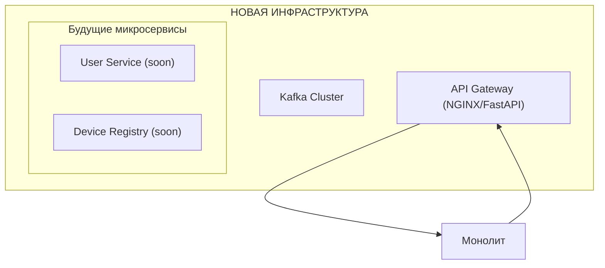

### Этап 2: Выделение User Service (первый микросервис)
* [2.mermaid](docs/as_is-to_be/2.mermaid)
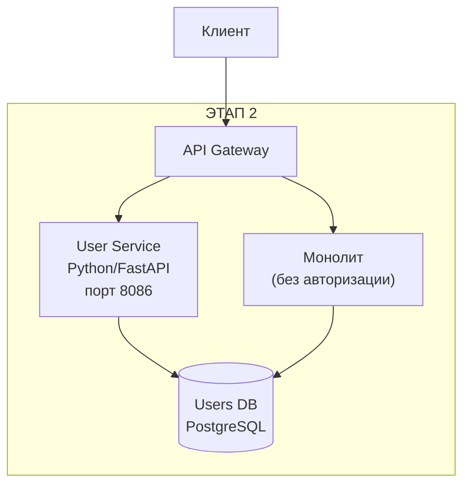

### Этап 3: Выделение Device Registry
* [3.mermaid](docs/as_is-to_be/3.mermaid)
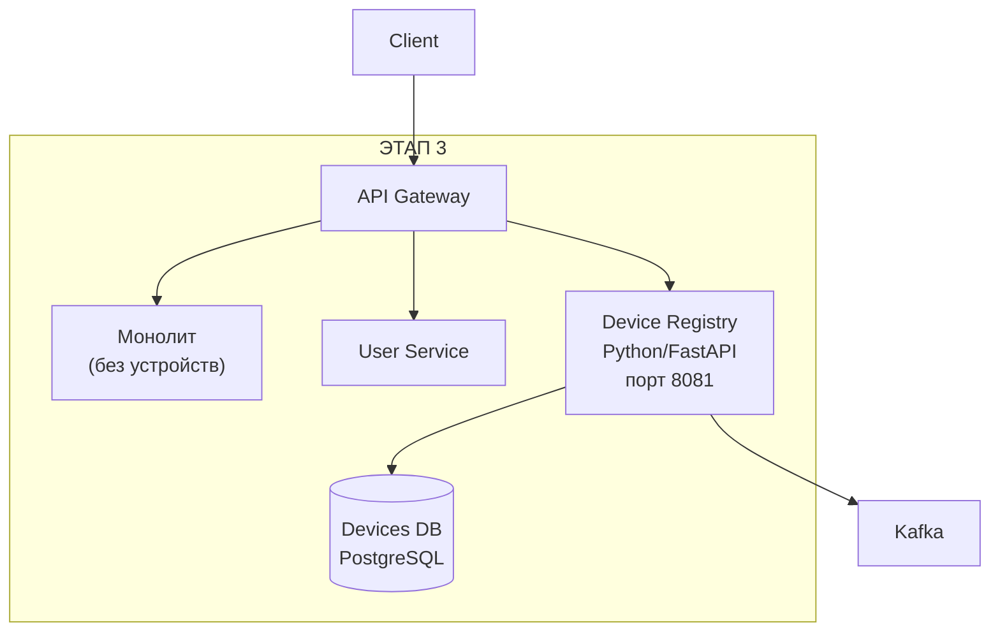

### Этап 4: Выделение Heating Control
* [4.mermaid](docs/as_is-to_be/4.mermaid)
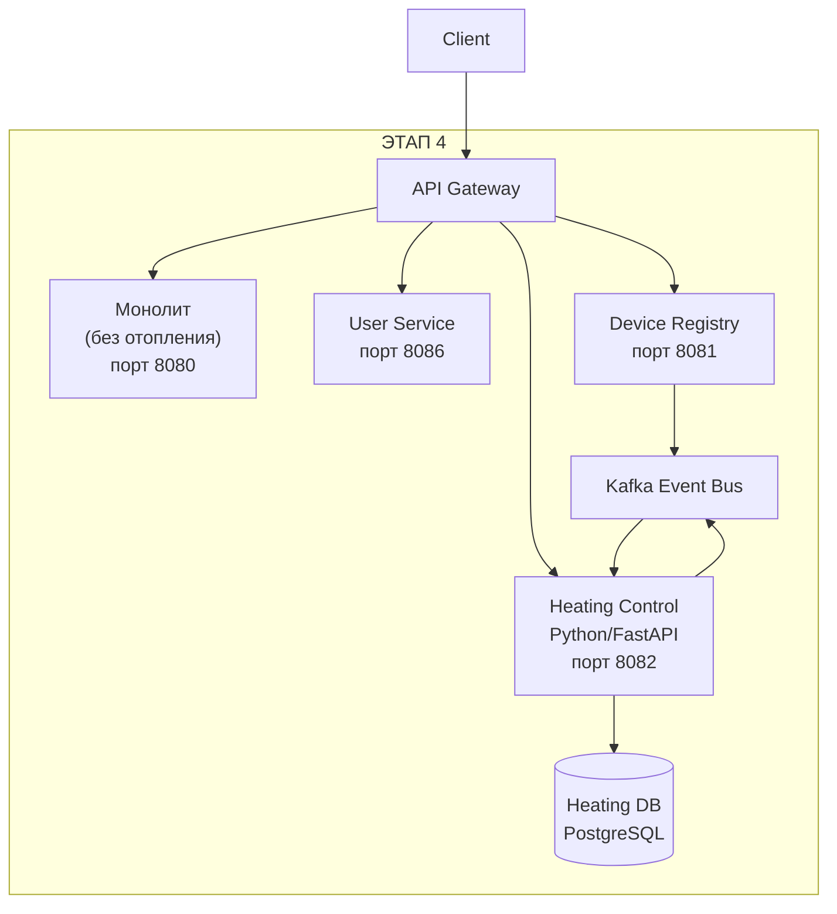

### Этап 5: Выделение остальных сервисов
* [5.mermaid](docs/as_is-to_be/5.mermaid)
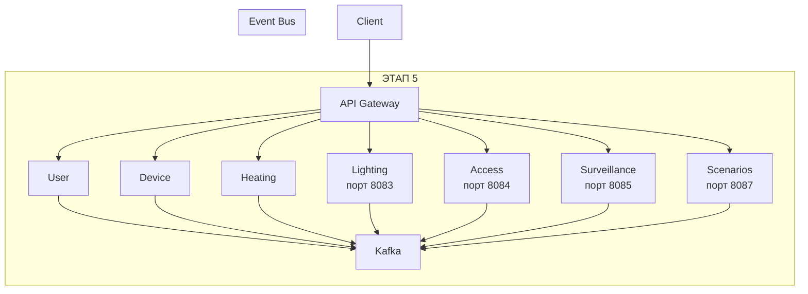
### Этап 6: Полное отключение монолита
* [6.mermaid](docs/as_is-to_be/6.mermaid)
```mermaid
graph TB
    subgraph "ФИНАЛ"
        Gateway["API Gateway"]
        Kafka["Kafka"]
        
        User["User"]
        Device["Device"]
        Heating["Heating"]
        Lighting["Lighting"]
        Access["Access"]
        Surveillance["Surveillance"]
        Scenarios["Scenarios"]
    end
    
    Client --> Gateway
    Gateway --> User
    Gateway --> Device
    Gateway --> Heating
    Gateway --> Lighting
    Gateway --> Access
    Gateway --> Surveillance
    Gateway --> Scenarios
    
    User --> Kafka
    Device --> Kafka
    Heating --> Kafka
    Lighting --> Kafka
    Access --> Kafka
    Surveillance --> Kafka
    Scenarios --> Kafka
    
    Monolith["Монолит
    (выключен)"] -.-x Gateway
```
### Стратегия отката (Rollback Plan)
* [rollback.mermaid](docs/as_is-to_be/rollback.mermaid)
```mermaid
graph LR
    A[Ошибка в новом сервисе] --> B{Критично?}
    B -->|Да| C[Вернуть трафик в монолит]
    B -->|Нет| D[Fix forward]
    
    C --> E[Анализ логов]
    E --> F[Исправить ошибку]
    F --> G[Повторить деплой]
```
